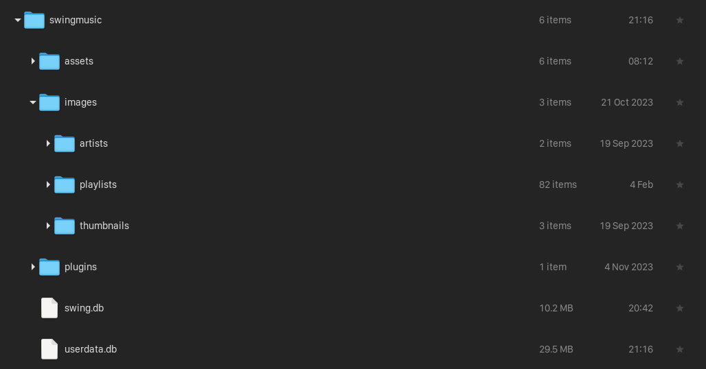

# Code Base Docs

Hello there

If you would like to contribute a feature or fix a bug in this project, you're more than welcome to do so. The workings of Swing Music and its code base is documented here.

## How Swing Music works

The Swing Music architecture looks something like this:

When you launch Swing Music, music is indexed and stored in the database. The same data is also loaded into memory for faster retrieval. This data is the made accesible by the help of a Flask REST API.

Most `READ` requests retrieve data from memory instead of the database. While `WRITE` requests update both the database and the memory.

### Indexing tracks

Swing music crawls the selected root dirs and finds all [supported files](https://github.com/swing-opensource/swingmusic/blob/f62fe0ac24d3cb356f43c31882fd60ba0976e28b/app/settings.py#L101). It extracts metadata such as title, artists and album from the files and stores them in the database. Along with the extracted metadata, the`trackhash` and `albumhash` properties are added to help with duplicate detection.

For more on how the `trackhash` and `albumhash` are generated and used, check out the page on [hashing](./hashing.md).

## The data folder

The data folder is used to store all the files and data used in Swing Music. This includes databases, images, etc. In Linux, it's usually under `~/.config/swingmusic`. The directory is resolved using the XDG Base Directory Specification (Check out `app/utils/xdg_utils.py`).

This folder contains a few folders inside:

- `/assets` - stores static assets used by the clients. THink logos, etc.
- `/images` - stores thumbnails, artist images and playlist covers.
- `/plugins` - stores data used by plugins

The directories are created in `app/setup/files.py` by the `create_config_dir` function.

## The databases

The databases store data for persistence. There are 2 databases:

- `swing.db` - stores metadata
- `userdata.db` - stores user data. Favorites, playlists, settings, etc.

For more on databases, see the [databases page](./databases.md).

## Stores

You might have noticed that Swing Music is very fast. Prolly faster than your average streaming server. This is because Swing Music does not read the database on each requests (at least not most of the time). All the data in the database is also loaded into memory.

For more on this topic, see the [stores page](./stores.md).
